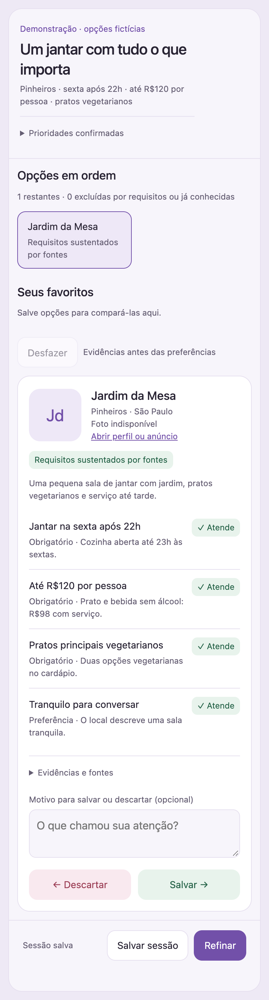

# Shortlist in practice

[← README](README.md) · [Install](INSTALL.md)

Give Shortlist the details that decide whether an option is useful: dates, location, budget, required features, and preferences. It confirms the brief before researching.

The prompts below use Codex's `$shortlist` marker. In Claude Code, replace it with `/shortlist`; the search and refinement requests are otherwise the same. Codex with visualize shows Evidence Desk inline; terminal users can review the same interface in a local browser and paste its Save/Refine message back into chat.

The screenshots below use fictional restaurants and reserved `.invalid` URLs. They demonstrate the real interface; their prices, opening hours, and source excerpts are invented fixture data.

## Dinner with actual constraints

```text
$shortlist Find restaurants in Pinheiros, São Paulo, for Friday dinner
after 10 pm. Dinner should be under R$120 per person, with vegetarian mains.
I prefer somewhere quiet enough for a conversation.
Check the exact branch's hours and menu, and show what remains uncertain.
```


The demo separates three must-haves from one preference. Fully supported must-haves rank ahead of an unresolved closing time. A favorite remains visible while you review other options.

## Follow the evidence

```text
For Mesa 27, verify whether the kitchen serves dinner after 10 pm on Friday.
The reservation calendar alone does not settle that.
Keep it provisional until you find branch-specific confirmation.
```


The calendar is useful evidence of a way to check the option, but the late kitchen hours stay **Unknown**. Expand **Evidence & source details** to see the excerpt, publisher, retrieval date, and scope. The screenshot is a local browser render; it does not establish delivery to a live Codex chat.

## Refine without losing favorites

1. Save a candidate you like and optionally explain why.
2. Pass on one that misses your preferences; a reason such as “too noisy” is useful feedback.
3. Click **Save session** and wait for the agent to confirm the saved file.
4. Click **Refine**, describe the next search, and submit **Save & request refinement**.

For example:

```text
Keep Casa Aurora saved. Find more options with a similar courtyard feel.
The noise level matters more than decor. Keep the same neighborhood,
Friday hours, vegetarian requirement, and budget.
```

The same session retains earlier favorites and rejects. Changes to hard requirements need confirmation. If you only want another batch, say so explicitly.

## A stay for the whole group

```text
$shortlist Find places to stay in Ubatuba for five adults, March 19–22, 2027.
Maximum R$2,400 total including fees. We need three real beds;
a sofa bed does not count. Prefer a beach within a 10-minute walk.
Check prices for those exact dates and five guests.
```

Shortlist should distinguish the listing's general capacity from the actual sleeping arrangement and total for your dates. If the final price or availability cannot be inspected, that requirement remains unknown with a next check.

To reuse earlier research:

```text
Use the URLs in my supplied sheet as already-known options.
Keep my saved places and find a new batch under the same requirements.
```

## Compare service providers

```text
$shortlist Find bicycle repair shops within 5 km of the city center.
They must service hydraulic disc brakes, open on Saturdays, and publish
a service price list. Prefer shops that offer online booking.
Ask me which city before researching.
```

Check the exact service, branch hours, pricing, and booking options separately. A general repair listing does not establish that the shop services hydraulic disc brakes. Missing prices or Saturday hours remain unknown until verified.

## Em português

```text
$shortlist Encontre restaurantes em Pinheiros para jantar na sexta depois
das 22h, até R$120 por pessoa, com pratos vegetarianos.
Prefiro um lugar tranquilo para conversar. Confira os horários e o cardápio
da unidade e mostre o que ainda precisa de confirmação.
```

<p align="center">
  
</p>

The interface supports English and Brazilian Portuguese. Candidate content is written in the search's language; the mobile screenshot uses a separate Portuguese fixture and the actual translated template.

## Resume later

```text
$shortlist Resume my dinner search. Keep my saved choices and recheck
Friday opening hours and menu prices before showing the next batch.
```

Ask in the same project or provide the session ID and known session location. Shortlist reloads the last acknowledged snapshot, rechecks changing facts, and retains your explicit review history.

## Preview the demo locally

From the repository root:

```sh
python3 skills/shortlist/scripts/session.py render \
  examples/dinner.json /tmp/shortlist-demo.html --standalone
```

Open `/tmp/shortlist-demo.html` in a modern browser. Save/Pass work locally; Save/Refine provide a copyable message for your Codex or Claude Code chat, since there is no host bridge. The fixture is marked `demo: true`, so its handoff asks the agent to exercise saving and rendering only. This preview does not create an acknowledged saved session; use the skill to save the fixture before applying a review snapshot.
