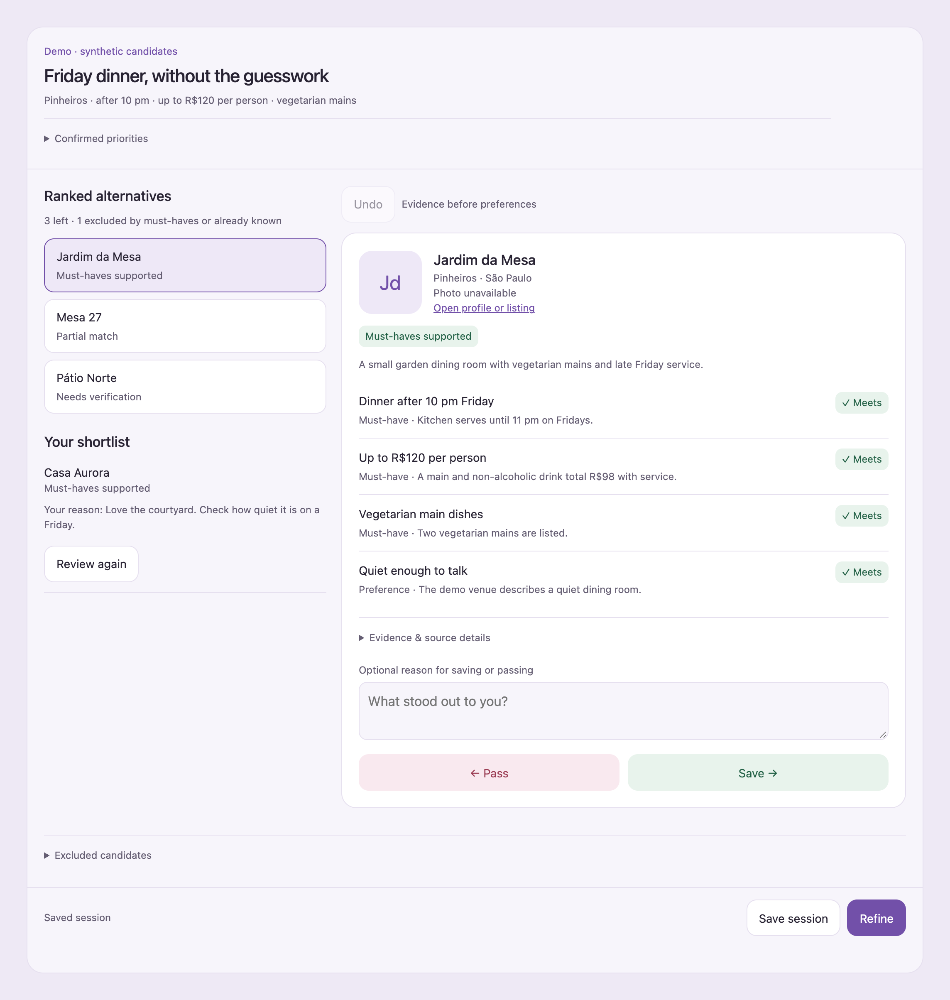
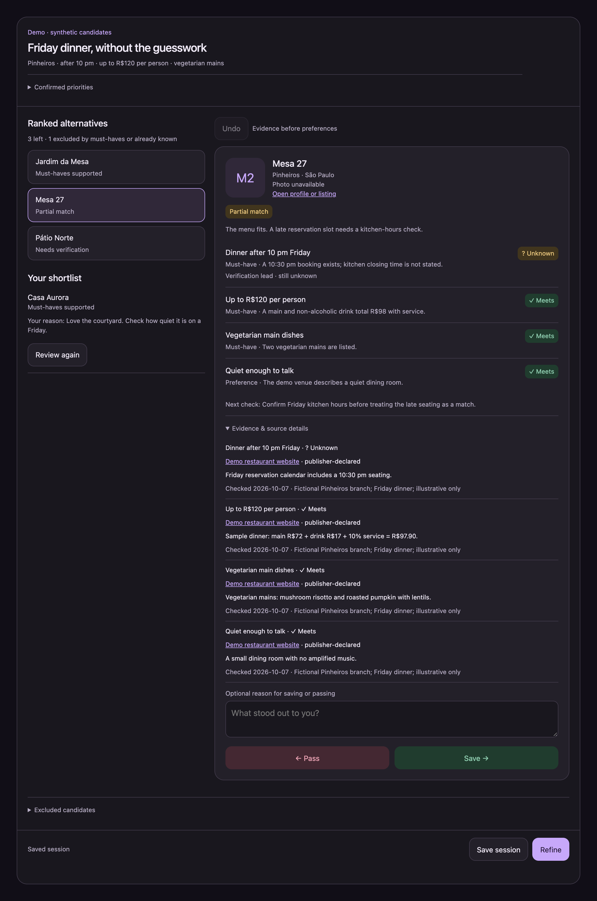

<div align="center">


# Shortlist

### Find your options. See the evidence. Keep the best.

A skill for Codex and Claude Code that researches options against multiple specific filters—the details that are hard to check manually—and presents a shortlist with evidence.

**Source-backed research · Save & refine · English + Português**

[Install](INSTALL.md) · [Examples](EXAMPLES.md) · [How it works](#how-it-works) · [Contribute](CONTRIBUTING.md)

</div>



<p align="center"><sub>The actual Evidence Desk interface, rendered with fictional demo restaurants. These are illustrative results, not recommendations.</sub></p>

## For searches with more than one filter

You need a restaurant open after 10 pm, within your budget, with vegetarian mains and a quiet room. Or a place to stay with specific sleeping arrangements, in the right area, available on your dates. Those details rarely live in one searchable database. Checking each option means reading menus, listings, schedules, and reviews, then keeping track of which requirements actually match.

Shortlist takes that detailed brief, researches each requirement, and puts the evidence beside each option. It flags missing or conflicting information so you can see what still needs checking. Review with **Save** and **Pass**, leave a reason when it helps, and ask for a better next batch.

```text
$shortlist Find restaurants in Pinheiros for Friday dinner after 10 pm.
Keep dinner under R$120 per person, with vegetarian mains.
I prefer somewhere quiet enough for a conversation.
```

## Install

### Codex

Ask its built-in skill installer:

```text
$skill-installer install https://github.com/ArthurCisotto/shortlist/tree/main/skills/shortlist
```

Once the skill appears, mention `$shortlist` with your search. If it does not appear, restart Codex.

### Claude Code

Install the same skill folder:

```sh
git clone https://github.com/ArthurCisotto/shortlist.git
cd shortlist
mkdir -p "$HOME/.claude/skills"
test ! -e "$HOME/.claude/skills/shortlist" && \
  cp -R skills/shortlist "$HOME/.claude/skills/shortlist"
```

Then start Claude Code and use `/shortlist` with your search. Personal installation and slash-command invocation follow [Claude Code's skills format](https://code.claude.com/docs/en/skills).

Both agents use the same research workflow and local session helper, requiring Python 3.10+ on macOS or Linux and available web research tools. Codex with **visualize** shows Evidence Desk inline. Claude Code and terminals can export it to a local browser, where **Save session** and **Refine** provide a message to paste into the agent chat. Text review is also supported. Node.js and Chrome are only needed for the optional Instagram browser helper and browser checks.

See [INSTALL.md](INSTALL.md) for manual installation, updates, optional Instagram setup, and troubleshooting. Shortlist is distributed as a standalone skill folder; this repository does not include a plugin marketplace installer.

| Host | Invoke | Review |
| --- | --- | --- |
| Codex with visualize | `$shortlist` | Inline Evidence Desk with the host's feedback bridge. |
| Codex CLI / Claude Code | `$shortlist` / `/shortlist` | Local browser page with copy/paste feedback, or sourced text in chat. |

## How it works

1. **Set the brief.** Confirm your must-haves and preferences before research starts.
2. **Check the options.** Inspect sources for the exact date, location, service, or listing you care about, including linked specifications and detailed conditions.
3. **Review the evidence.** Compare ranked alternatives, open sources, and see what remains unresolved.
4. **Keep and refine.** Save or pass, add optional reasons, and use **Save session** or **Refine** to preserve the review through the agent.

### Every claim has a status

| Status | What it tells you |
| --- | --- |
| **✓ Meets** | A source supports the criterion. |
| **× Does not meet** | A source contradicts it. A failed must-have excludes the option. |
| **? Unknown** | The decisive detail could not be verified. |
| **! Conflicting** | Sources disagree; the disagreement stays visible. |

Excluded candidates remain in a collapsed section. Expand it to review every criterion and its sources, with confirmed failures clearly marked.

Must-have evidence comes before preferences. Unknowns remain unknown, even when there is a useful lead for checking them. Each option can show the next verification step, alongside source excerpts, dates, and scope.

Before presenting results, Shortlist follows up on decisive gaps and checks whether each source applies to the exact option and requirement. An unknown explains whether the detail was missing, the source was inaccessible, or its applicability was unclear. A summary claim does not override contradictory detailed conditions.



<p align="center"><sub>A promising option can stay provisional. The source supports a verification route, not a confirmed closing time.</sub></p>

## What can you shortlist?

| Search | Details worth checking |
| --- | --- |
| **Restaurants** | Branch-specific hours, menus, budget, dietary options, atmosphere. |
| **Places to stay** | Dates, guests, actual sleeping arrangements, total cost, location. |
| **Service providers** | Exact service, registration where relevant, appointment format, billing. |
| **Products and listings** | Required specifications, availability, seller claims, comparable costs. |

[EXAMPLES.md](EXAMPLES.md) includes ready-to-use prompts, a refinement conversation, and a Portuguese example.

## Keep your search moving

- **Reasons stay explicit.** “Too loud” helps the next search. A Save or Pass alone does not change your preferences.
- **Favorites survive the next batch.** Resume the same session, retaining saved and passed options with stable IDs.
- **Known listings stay out of new results.** Import URLs from earlier searches or supplied sheets; recognized duplicates are suppressed.
- **Changing facts get rechecked.** Availability, prices, opening hours, and similar details are reviewed again when you resume.

## Saving and privacy

Sessions are stored locally as JSON in an ignored `.shortlist/` directory. The helper validates each snapshot, writes it atomically, and checks the saved file. Revision checks prevent an older review from silently replacing a newer one.

**A local Save or Pass is pending until the agent confirms Save session or Refine.** The standalone browser view provides a message to paste into the same chat; keep the page open until the agent confirms saving. Reload the page after the agent re-renders it. Closing or refreshing earlier loses unsaved review changes. A successful host-bridge request alone is not proof of a durable save.

Your agent uses the research tools available in its host. Relevant session content may also reach the agent through explicit save/refine messages or host widget state. “Stored locally” describes the session files, not offline research or a guarantee that no data leaves the host.

All committed examples and screenshots are synthetic. The optional Instagram helper uses a clean browser context and does not read your personal Chrome profile.

## Inside the repo

| Location | Purpose |
| --- | --- |
| [`skills/shortlist/`](skills/shortlist/) | The installable skill: instructions, helpers, references, and UI. |
| [`examples/`](examples/) | Fictional session fixtures used for screenshots and local previews. |
| [`docs/images/`](docs/images/) | Screenshots of the real interface and the project mark. |
| [`tests/`](tests/) | Session and interface checks, synthetic agent evaluations, and optional Instagram helper checks. |
| [`scripts/eval_behavior.py`](scripts/eval_behavior.py), [`scripts/eval_research.py`](scripts/eval_research.py) | Optional agent evaluations for interpreting evidence and retrieving it from controlled pages. |
| [`GLOSSARY.md`](GLOSSARY.md) | Shared vocabulary for criteria, evidence, and review decisions. |

The core session helper uses only Python's standard library. Browser tooling is optional and installed separately.

## Development

```sh
python3 -m unittest discover -s tests -p 'test_*.py'
```

Optional evaluations use an authenticated Claude Code CLI:

```sh
python3 scripts/eval_behavior.py run
python3 scripts/eval_research.py run
```

These test interpretation and controlled page retrieval, respectively. They do not establish live-web accuracy; explanations still need review. See [CONTRIBUTING.md](CONTRIBUTING.md) for evaluation scope, browser checks, screenshot regeneration, and verification of agent handoffs.

---

<p align="center">For finding options that fit your specific requirements.</p>
